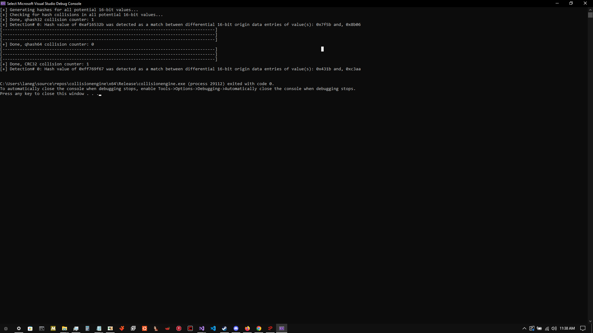

  

                                         		qengine - Research and Development 

## This is the Research & Development branch of the qengine project which consists of a single visual studio solution currently containing projects which test the security of different features of qengine and attempt to descript the output produced by the engine.

--------------------------------------------------------------------------------------------------------------------------------------------------------------------------------------------------------------

 collisionengine - Security Testing of the  qhash32 / qhash64 / CRC-32 (Cyclic Redundancy Check 32)  Algorithm's  

collisionengine is an project which was created to test the security and accuracy of the qhash32 / qhash64 algorithm(s) as implemented in [qengine](https://github.com/Chemiculs/qengine) and test their efficacy against the CRC32 algorithm as implemented in the [Boost Project](https://github.com/boostorg/boost) (license attached) -

which you must link against in your project settings and include its source directories as well in order to compile collisionengine .

collisionengine performs the following operations, in the according order:

1. iterate all potential values of 16-bit's of data in memory

2. generate the digest for each potential 16-bit dataset for the qhash32, qhash64, and CRC32 algorithm(s) and store them in according vector's 

3. compare each digest against all 65534 other digest(s) produced from the according 16-bit dataset(s)

4. print the number of collisions between the digest(s) of differing 16-bit dataset(s) and a Hexadecimal representation of the corresponding binary data which produced the colliding digest(s), alongside the Hexadecimal representation of the collided digest itself.

The output from this program will stay constant, here is what should occur when executed:

--------------------------------------------------------------------------------------------------------------------------------------------------------------------------------------------------------------

More of these tests will be coming out over the coming weeks as i have a seeming amount of time available to build this repository finally while also working on qengine itself further - improving it and fixing bugs.
